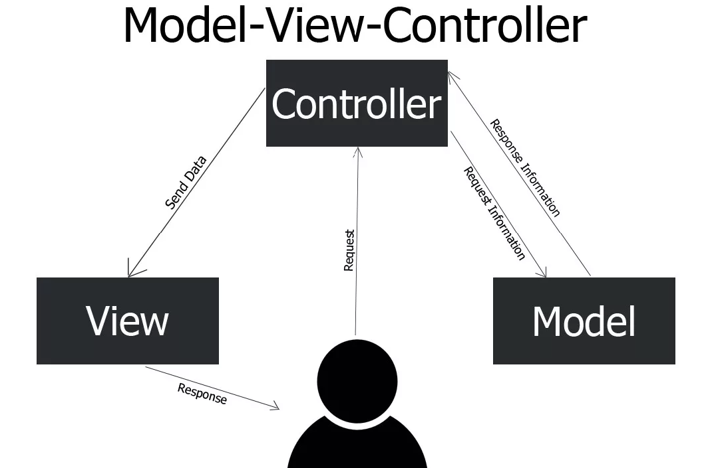

# Введение в фреймворки. Архитектура MVC. Express.js

При разработке веб-приложений использование фреймоврков стало некоторым стандартом. Фреймворки предоставляют разработчикам готовые решения для типичных задач, что позволяет ускорить процесс разработки и улучшить качество кода.

_Фреймворк_ — это набор библиотек, инструментов и стандартов, который позволяет разработчикам создавать приложения быстрее и эффективнее [^1].

Фреймворк выполняет следующие функции:

1. Предоставляет готовые решения для типовых задач, таких как маршрутизация, обработка запросов, работа с базами данных и управление сессиями.
2. Обеспечивает структурированность кода и упрощает его поддержку благодаря четко определенным шаблонам проектирования, таким как MVC (Model-View-Controller).
3. Способствует улучшению безопасности приложения, предлагая проверенные и тестированные методы защиты данных и предотвращения уязвимостей.

Проще говоря, _фреймворк_ — это заранее подготовленный «скелет» проекта, созданный разработчиками для того, чтобы вам не приходилось каждый раз писать с нуля однотипный код для типичных задач. Вместо того чтобы каждый раз изобретать велосипед, мы можем воспользоваться фреймворком, где уже реализованы многие распространённые функции. Это экономит время и силы, позволяя сосредоточиться на особенностях вашего приложения, а не на рутинных вещах.

Например, при создании веб-приложения фреймворк предоставляет готовые инструменты для работы с базой данных, обработки запросов и отображения данных на странице. Это освобождает вас от необходимости писать все эти функции с нуля и позволяет сосредоточиться на логике приложения.

## Архитектура MVC

При работе над сложными приложениями очень важно правильно организовать код. Со временем, по мере роста проекта, логика программы может превратиться в спутанный комок – всё перемешано, разобраться и внести изменения сложно. Чтобы этого избежать, разработчики используют определённые _архитектурные шаблоны_ – проверенные подходы к структурированию приложения.

Один из самых распространённых шаблонов в веб-разработке – это MVC, что расшифровывается как _Model–View–Controller_ (модель–представление–контроллер) [^2]. MVC разделяет приложение на три компонента, каждый из которых отвечает за свою задачу. Этот подход устанавливает чёткие границы между разными частями функциональности, что упрощает поддержку кода и сотрудничество в команде. Рассмотрим подробно каждую составляющую MVC и их взаимодействие.

### Model (Модель)

Model (Модель) отвечает за данные и логику приложения. Она взаимодействует с базой данных, выполняет операции по созданию, чтению, обновлению и удалению данных (CRUD). Модель также содержит бизнес-логику, которая определяет, как данные должны обрабатываться и какие правила применяются. Проще говоря, модель представляет то, с чем оперирует ваше приложение в реальном мире. Модель может проверять корректность данных, применять к ним бизнес-правила и уведомлять другие части системы об изменениях данных.

Например, если вы разрабатываете блог, моделью могут быть объекты “Статья”, “Пользователь” или “Комментарий” со свойствами и методами для работы с этими данными.

### View (Представление)

_Представление_ – это пользовательский интерфейс, всё, что непосредственно видит и с чем взаимодействует пользователь. В веб-приложении под представлениями обычно понимают веб-страницы (HTML-код), шаблоны или иные формы вывода информации. View отвечает за отображение данных модели в удобном виде: рисует элементы интерфейса, формирует HTML-разметку, показывает сообщения пользователю. _Важная особенность представления_: оно не содержит сложной логики, связанной с данными – только логику отображения.

Например, в нашем блоге представлением будет HTML-страница, которая показывает список статей или форму для добавления новой статьи. Представление знает, как показать данные пользователю, и обновляется, когда модель предоставляет новые данные.

### Controller (Контроллер)

_Контроллер_ – это связующее звено между пользователем (через View) и моделью. Контроллер принимает входящие запросы или действия пользователя, обрабатывает их (в этой части заложена логика приложения) и решает, что делать дальше: какие данные запросить у модели и какое представление затем показать пользователю.

В примере с блогом контроллер получает запрос от пользователя (например, “открыть страницу со списком статей” или “сохранить новую статью”), обращается к соответствующей модели (получить список статей из базы данных или попросить модель создать новую запись) и затем выбирает нужное представление (шаблон страницы) для отображения результата пользователю.

Контроллер содержит логику обработки процессов: проверка прав пользователя, последовательность шагов, выбор куда перенаправить пользователя и т.д.



_Рисунок 1. Взаимодействие компонентов MVC_

### Взаимодействие компонентов MVC

Как же эти три компонента работают вместе? Взаимодействие в шаблоне MVC можно описать следующим пошаговым сценарием:

1. _Действие пользователя (View → Controller)_. Пользователь взаимодействует с интерфейсом – кликает кнопку, заполняет форму, переходит по ссылке. Это действие передаётся от представления к контроллеру. Например, пользователь нажал “Создать новую статью” на веб-странице (представлении).
2. _Обработка запроса (Controller → Model)_. Контроллер получает сигнал о действии и понимает, что именно хочет сделать пользователь. Он обращается к модели, если требуется получить или изменить данные. В нашем примере контроллер может собрать данные из формы “Новая статья” и попросить модель сохранить новую статью в базе данных.
3. _Работа с данными (Model)_. Модель выполняет запрос контроллера – например, сохраняет новую статью, проверяя ее данные, или извлекает из хранилища запрошенные сведения. После выполнения операции модель может вернуть результат контроллеру (например, успешно сохранённый объект статьи или данные для отображения).
4. _Выбор представления (Controller → View)_. Получив необходимые данные от модели, контроллер решает, какое представление использовать для ответа пользователю. Он может подготовить данные в удобном для представления виде и передать их в шаблон. В случае успешного создания статьи контроллер может перенаправить пользователя на страницу просмотра этой статьи – для этого он выберет соответствующий шаблон представления и передаст ему данные новой статьи.
5. _Отображение результата (View)_. Представление, получив данные, формирует их визуальное представление и отображает пользователю обновлённый интерфейс. Пользователь видит результат своего действия – например, страницу с новой статьёй, которую он только что добавил.

## Express: минималистичный фреймворк для Node.js

Мы выяснили, что на бэкенде фреймворки облегчают создание серверной логики.

_Express_ – это как раз один из самых популярных бэкенд-фреймворков, написанных на JavaScript (точнее, для среды Node.js).

На прошлых лекциях мы говориил, что Node.JS сам по себе позволяет поднять веб-сервер и обрабатывать HTTP-запросы, используя встроенный модуль `http`.

_Пример 1_. Создание простого HTTP-сервера на Node.js

```javascript
const http = require("http");

const server = http.createServer((req, res) => {
  res.statusCode = 200;
  res.setHeader("Content-Type", "text/plain");
  res.end("Hello, World!\n");
});

const PORT = 3000;

server.listen(PORT, () => {
  console.log(`Server running at http://localhost:${PORT}/`);
});
```

Если пользователь откроет в браузере `http://localhost:3000`, он увидит сообщение "Hello, World!".

Однако, данный способ требует от нас "вручную" разбирать URL (какой URL ввел пользователь), методы запросов, заголовки, писать много шаблонного кода. Поэтому, разрабатывая бэкенд-приложения на Node.JS, чаще всего используют _Express.JS [^4] – минималистичный и гибкий фреймворк_, который упрощает создание серверных приложений. Под “минималистичным” понимается, что в ядре Express есть только самые необходимые базовые возможности – всё лишнее можно подключить дополнительно по мере необходимости. А “гибким” его называют, потому, что Express не навязывает жёсткую архитектуру вашего приложения [^3]. В нём вы сами решаете, как организовать файлы, какие библиотеки подключить – полная свобода. Это отличается от более “тяжёлых” фреймворков, которые диктуют определенную структуру проекта и набор инструментов.

Несмотря на свою лёгкость, Express чрезвычайно мощный: он предоставляет разработчику удобный набор инструментов для создания веб-приложений и API. Не зря Express уже много лет удерживает позицию самого популярного фреймворка для бэкенда на Node.js. При этом Express не скрывает от вас сам Node.js – вы по-прежнему можете использовать все возможности платформы, просто делаете это быстрее и с более лаконичным кодом. Рассмотрим основные возможности Express и как с ним работать.

### Установка и создание простого сервера на Express

Чтобы начать использовать Express, вам нужен установленный Node.js и менеджер пакетов npm. Express распространяется как пакет npm. Шаги для старта обычно такие:

1. _Инициализация проекта Node_. В пустой папке выполните команду:

   ```bash
   npm init -y
   ```

   Это создаст файл `package.json` с настройками вашего проекта.

2. _Установка Express_. Выполните команду:

   ```bash
   npm install express
   ```

   После установки в папке `node_modules` появится директория с Express и его зависимостями, а в `package.json` добавится запись о зависимости.

3. _Создание файла приложения_. Для создания простого сервера создайте файл `app.js` с таким содержимым. Файл можно назвать иначе, но традиционно используют `app.js`, `server.js` или `index.js`.

   ```javascript
   const express = require("express"); // Подключаем фреймворк Express
   const app = express(); // Инициализируем приложение
   const port = 3000; // Задаём номер порта

   // Определяем маршрут: при обращении GET-запросом к корневому URL "/" выполнить функцию
   app.get("/", (req, res) => {
     res.send("Hello, world!"); // Ответом отправляем строку "Hello, world!"
   });

   // Запускаем сервер на указанном порту
   app.listen(port, () => {
     console.log(`Server is running on port ${port}`);
   });
   ```

   В данном примере мы создаём сервер, который слушает порт 3000 и отвечает "Hello, world!" на GET-запросы к корневому URL (`/`).

4. _Запуск сервера_. В терминале выполните команду. 

   ```bash
    node app.js
    ```

    После запуска в терминале появится сообщение `Server is running on port 3000`. Теперь, если вы откроете в браузере `http://localhost:3000`, вы увидите сообщение "Hello, world!".

Если Вы внесете изменения в файл `app.js`, чтобы они вступили в силу, нужно будет перезапустить сервер (остановить его комбинацией Ctrl+C и запустить команду `node app.js` снова). Для удобства разработки можно использовать пакет `nodemon`, который автоматически перезапускает сервер при изменении файлов: вы сохраняете изменения, а `nodemon` перезапускает сервер за вас.

```bash
# Установка nodemon глобально
npm install -g nodemon

# Запуск сервера с помощью nodemon
nodemon app.js
```

[^1]: _What Is a Framework?_. codeacademy [online]. Available at: https://www.codecademy.com/resources/blog/what-is-a-framework
[^2]: _MVC Architecture Explained: Model, View, Controller_. codeacademy [online]. Available at: https://www.codecademy.com/article/mvc-architecture-model-view-controller
[^3]: _Introduction to Express_. theodinproject.com [online]. Available at: https://www.theodinproject.com/lessons/node-path-nodejs-introduction-to-express
[^4]: _Express.JS_. expressjs.com [online]. Available at: https://expressjs.com/
