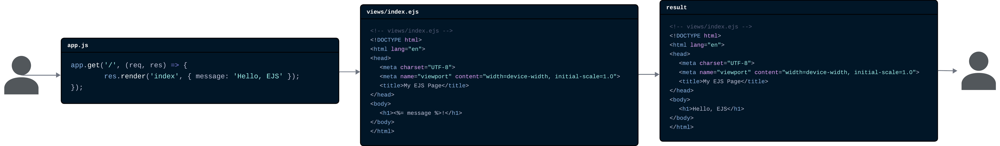

# Шаблонизация и шаблонизаторы. Обработка запросов

## Что такое шаблонизация и зачем нужны шаблонизаторы?

При разработке веб-приложений часто требуется создавать HTML-страницы динамически, в зависимости от данных. Например, на странице профиля пользователя нужно отобразить его имя, фото и другие персональные данные, которые хранятся в базе данных. Для каждой страницы может быть свой набор данных, и создавать отдельный HTML-файл для каждого пользователя или каждой страницы было бы крайне неудобно и неэффективно. Данную проблему решает _шаблонизация_.

_Шаблонизация_ - это процесс формирования HTML-кода на основе заранее заготовленного шаблона с подстановкой в него динамических данных.

_Шаблон_ - это HTML-файл, в котором есть специальные метки (плейсхолдеры), обозначающие места, куда будут подставляться данные. Например, у вас есть структура шаблона "профиль пользователя", в которой есть места для имени, фото и других данных, которые являются динамическими.

При обработке запроса сервер берет этот шаблон и в места где указаны плейсхолдеры подставляет реальные данные, полученные из базы данных или других источников, генерируя полноценную HTML-страницу, которая отправляется пользователю [^1]. Это позволяет отделить логику приложения (например, вычисления, работу с базой данных) от кода представления (HTML-разметки), делая разработку более удобной и структуру проекта более понятной. В итоге одна часть приложения отвечает за обработку данных, а результат этой обработки отображается на веб-странице с помощью шаблонов.

_Псевдокод примера использования шаблонизатора_.

```
// Получаем данные пользователя из базы данных
userData = getUserDataFromDatabase(userId)

// Генерируем HTML-страницу на основе шаблона и данных пользователя
htmlContent = renderTemplate('userProfileTemplate.html', userData)

// Отправляем сгенерированную HTML-страницу пользователю
sendResponse(htmlContent)
```

Помимо вставки переменных, шаблоны позволяют выполнять в разметке простейшую логику - например, условия и циклы для отображения списка элементов. Например, можно отобразить список комментариев пользователя, если они есть, или показать сообщение "Комментариев нет", если список пуст. Таким образом, шаблонизация делает возможным создание динамических страниц на сервере и упрощает дизайн HTML-страниц.

Для шаблонизации в веб-разработке используются _шаблонизаторы_ (или движки шаблонов, англ. template engines) - это специальные библиотеки или встроенные средства фреймворка, которые обрабатывают шаблон и превращают его в HTML. Простыми словами это инструменты, которые генерируют HTML-код на основе шаблонов и данных.

Шаблонизатор берет статический шаблонный файл и на этапе выполнения (runtime) заменяет в нём все переменные на их фактические значения, а также исполняет встроенные в шаблон простые сценарии (условия, циклы), чтобы сформировать итоговый HTML. Применение шаблонизаторов облегчает создание страниц: разработчику не нужно генерировать HTML вручную в коде, достаточно подготовить шаблон с плейсхолдерами и логикой, а шаблонизатор сделает остальное.

Существует множество шаблонизаторов для разных языков и фреймворков. В экосистеме Node.js (и фреймворка Express) популярны следующие шаблонизаторы:

- _EJS (Embedded JavaScript)_ - простой и популярный шаблонизатор, позволяющий вставлять JavaScript-код прямо в HTML.
- _Pug (ранее Jade)_ - шаблонизатор с лаконичным синтаксисом, который использует отступы для обозначения вложенности.

В данной лекции мы рассмотрим использование шаблонизатора EJS в связке с Express.js.

> Хотя шаблонизация и использование шаблонизаторов напрямую не относятся к backend-разработке, это важный аспект веб-разработки. Владение данным инструментом полезно любому веб-разработчику, особенно при работе с серверными фреймворками, такими как Express.js.

## Использование шаблонов в Express

### Подключение и настройка EJS в Express

Рассмотрим, как подключить и использовать шаблонизатор EJS в приложении на Express (Node.js). Предположим, у нас уже настроен базовый Express-сервер. Для начала нужно установить пакет EJS и сообщить Express, что мы собираемся его использовать для рендеринга представлений.

_Установка и подключение EJS_. Выполните установку EJS через npm и настройте Express-приложение:

1. Установить пакет EJS командой: `npm install ejs`
2. В директории проекта создать папку `views`, где будут храниться шаблоны.
3. Настроить Express на использование EJS. Для этого в файле основного приложения (например, app.js) нужно задать две настройки:

   1. Каталог с шаблонами (views).
   2. Выбранный движок шаблонов.

   ```javascript
   // app.js
   import path from "path";
   import express from "express";

   const app = express();
   app.set("views", path.join(__dirname, "views")); // Путь к папке с шаблонами
   app.set("view engine", "ejs"); // Установка EJS в качестве шаб
   ```

   - Первая строчка указывает приложению, в каком каталоге искать шаблонные файлы (в данном случае мы соединяем путь текущей директории с поддиректорией _"views"_).
   - Вторая строка устанавливает EJS в качестве движка представлений по умолчанию.

4. Создать файл шаблона, например `index.ejs`, в папке `views`. Ниже представлен пример простого шаблона EJS, который отображает сообщение.

   ```html
   <!-- views/index.ejs -->
   <!DOCTYPE html>
   <html lang="en">
     <head>
       <meta charset="UTF-8" />
       <meta name="viewport" content="width=device-width, initial-scale=1.0" />
       <title>My EJS Page</title>
     </head>
     <body>
       <h1><%= message %>!</h1>
     </body>
   </html>
   ```

   - В этом шаблоне используется конструкция `<%= message %>`, - она означает «_вывести значение переменной message на этом месте_».

5. Настроить маршрут в Express, который будет рендерить этот шаблон и передавать в него данные. Например, создадим маршрут для главной страницы.

   ```javascript
   // app.js
   // ... предыдущий код ...
   app.get("/", (req, res) => {
     res.render("index", { message: "Hello, EJS" }); // Рендерим шаблон index.ejs с данными
   });
   ```

   - Когда клиент отправляет GET-запрос на корневой URL `/`, выполняется этот обработчик.
   - Здесь метод `res.render("index", { message: "Hello, EJS" })` загружает шаблон index.ejs из папки views и передаёт в него объект с данными.
   - Мы передали объект `{ message: "Hello, EJS" }`, поэтому внутри шаблона переменная message будет доступна и равна "Hello, EJS".
   - В результате EJS сгенерирует HTML-код, подставив наш текст вместо `<%= message %>`. Готовый HTML отправляется браузеру как ответ.

   Полная схема представлена на рисунке ниже:

   

6. Запустите сервер и откройте в браузере `http://localhost:3000` (или другой порт, на котором работает ваш сервер). Вы должны увидеть страницу с заголовком "Hello, EJS!".

### Вставка JavaScript-логики в шаблон

Одним из преимуществ шаблонизаторов является возможность включать простую логику прямо в HTML.

В EJS внутри `<% ... %>` мы можем писать условные операторы `if`, циклы `for/while`, использовать методы массивов и т.д. Это помогает, например, отображать список элементов или показывать/скрывать части страницы в зависимости от данных.

_Пример_. Допустим, мы передали в шаблон массив с названиями животных и хотим вывести их в виде списка. Мы можем использовать цикл `for` внутри шаблона:

```js
<% const animals = ["Cat", "Dog", "Lemur", "Hawk"]; %>
<ul>
  <% for (let animal of animals) { %>
    <li><%= animal %>s are great!</li>
  <% } %>
</ul>
```

- В этом коде строка `<% const animals = [...]; %>` определяет массив (для примера он захардкожен прямо в шаблоне, но чаще массив приходит с сервера через `res.render`).
- Затем с помощью `<% ... %>` мы запускаем цикл `for` по каждому элементу массива `animals`. На каждой итерации выводим новый пункт списка `<li>` с названием животного.

В итоге после рендеринга шаблона браузер получит HTML-код примерно такого вида:

```html
<ul>
  <li>Cats are great!</li>
  <li>Dogs are great!</li>
  <li>Lemurs are great!</li>
  <li>Hawks are great!</li>
</ul>
```

Подобным образом можно использовать `if/else` для условного вывода. Например:

```js
<p>
  <% if (user) { %>
    Привет, <%= user.name %>!
  <% } else { %>
    Привет, гость!
  <% } %>
</p>
```

Здесь, если переменная user передана и не пустая, отобразится приветствие с именем, иначе - обращение _«гость»_. Эта логика выполняется на стороне сервера при генерации страницы.

> Важно понимать, что шаблон - это не полноценный скрипт, а скорее HTML-документ с вкраплениями JavaScript. Шаблонизаторы обычно ограничивают возможности JS в шаблоне: там не стоит выполнять тяжелые вычисления или работать с файлами/базой. Шаблон предназначен только для представления данных, а получение и подготовка этих данных происходит в коде сервера.

### Использование частичных шаблонов (partials)

В больших проектах часто возникает необходимость повторно использовать одни и те же части HTML-кода на разных страницах. Например, шапка сайта (header), подвал (footer) или навигационное меню. Чтобы не дублировать один и тот же код в каждом шаблоне, используются _частичные шаблоны_ (partials).

В EJS для этого служит директива `<%- include('имя_шаблона') %>`. Она вставляет содержимое указанного шаблона на место директивы.

Например, можно создать файл `views/navbar.ejs` с навигационным меню и включать его на разных страницах: `<%- include('navbar') %>`. Также можно передавать include'ам данные, например: `<%- include('navbar', { links: linksArray }) %>` – и внутри `navbar.ejs` использовать переменную `links`.

_Пример использования частичного шаблона_:

```html
<!-- views/navbar.ejs -->
<nav>
  <ul>
    <% links.forEach(link => { %>
    <li><a href="<%= link.href %>"><%= link.text %></a></li>
    <% }) %>
  </ul>
</nav>
```

```html
<!-- views/index.ejs -->
<!DOCTYPE html>
<html lang="en">
  <head>
    <meta charset="UTF-8" />
    <meta name="viewport" content="width=device-width, initial-scale=1.0" />
    <title>My EJS Page</title>
  </head>
  <body>
    <%- include('navbar', { links: [ { href: '/', text: 'Home' }, { href:
    '/about', text: 'About' } ] }) %>
    <h1><%= message %>!</h1>
  </body>
</html>
```

## Отправка данных на сервер

Данные от клиента к серверу могут передаваться различными способами в зависимости от типа запроса и используемых технологий. Основные методы передачи следующие:

- _HTML-формы_. Классический способ отправки данных на сервер – использование HTML-форм. Пользователь заполняет поля формы и нажимает кнопку отправки, после чего браузер формирует HTTP-запрос (обычно с методом GET или POST) и отправляет его на сервер. Сервер принимает этот запрос и обрабатывает переданные данные.
- _AJAX-запросы_. AJAX-запросы. Технология AJAX (Asynchronous JavaScript and XML) позволяет передавать данные между клиентом и сервером без перезагрузки страницы. С помощью JavaScript (например, через Fetch API или XMLHttpRequest) можно отправлять данные в формате JSON или других форматах и получать ответ от сервера. Такой способ особенно удобен для динамичных веб-приложений и часто используется для взаимодействия между фронтенд- и бэкенд-частями приложения.

Разберем пример отправки данных с помощью HTML-формы и простых AJAX-запросов.

### Отправка и получение данных с помощью HTML-форм

Форма в HTML описывается тегом `<form>` с рядом атрибутов, определяющих, как и куда будут отправлены введённые данные. Внутри `<form>` располагаются элементы ввода (`<input>`, `<select>`, `<textarea>`, etc.) и кнопка `<button type="submit">` для отправки [^3]. Простейший пример формы:

```html
<form action="/create" method="POST">
  <label for="fullName">Full Name:</label>
  <input placeholder="John Doe" type="text" name="fullName" id="fullName">
  <button type="submit">Submit</button>
</form>
```

Данные с формы отправлются на сервер в формате:
- URL-кодирования (application/x-www-form-urlencoded)
- multipart/form-data (для файлов).

Пример выше отправит POST-запрос на маршрут `/create` с полем `fullName`. В теле запроса будет строка `fullName=John+Doe`.

Для обработки данных, отправленных с формы, в Express-приложении нужно использовать *middleware для парсинга тела запроса*.

```javascript
import express from "express";
const app = express();

// Опция { extended: true } позволяет парсить более сложные объекты (вложенные структуры)
app.use(express.urlencoded({ extended: true })); // Для парсинга application/x-www-form-urlencoded
```

Если вы не включите этот middleware, `req.body` в маршруте останется пустым (равным `{}`), даже если данные отправлены корректно. Поэтому очень важно не забыть настроить парсинг тела запросов при работе с формами. Подключать этот middleware обычно нужно до объявления маршрутов, чтобы к моменту попадания в обработчик данные уже были распарсены. Пример маршрута для обработки формы:

```javascript
app.post("/create", (req, res) => {
    // извлекаем поле "fullName" из данных формы
    const fullName = req.body.fullName; 
    //  Далее можно, например, сохранить это имя или использовать по логике...
    res.send(`User created: ${fullName}`);
});
```

В данном примере при отправке формы на `/create` сервер получит данные, извлечет значение поля `fullName` из `req.body` и отправит сообщение с этим именем в ответ.

Чтобы получить данные из разных типов полей формы, нужно использовать атрибут `name` в элементах ввода. Например:

```html
<form action="/create" method="POST">
  <input type="text" name="fullName" placeholder="Full Name">
  <input type="email" name="email" placeholder="Email">
  <input type="checkbox" name="subscribe" value="yes"> Yes, I want to subscribe
  <button type="submit">Submit</button>
</form>
```

Объект `req.body` на сервере будет выглядеть так:

```json
{
  "fullName": "John Doe",
  "email": "john@example.com",
  "subscribe": "yes",
}
```

Если мы хотим отправить массив значений (например, при использовании нескольких чекбоксов с одинаковым именем), нужно указать имя с квадратными скобками, например `name="hobbies[]"`. Тогда в `req.body.hobbies` будет массив выбранных значений.

```html
<form action="/create" method="POST">
  <input type="checkbox" name="hobbies[]" value="reading"> Reading
  <input type="checkbox" name="hobbies[]" value="traveling"> Traveling
  <input type="checkbox" name="hobbies[]" value="gaming"> Gaming
  <button type="submit">Submit</button>
</form>
```

В примере выше, если пользователь выберет "Reading" и "Gaming", то на сервере в `req.body.hobbies` будет массив: `["reading", "gaming"]`.

### Получение данных в формате JSON

Помимо форм, данные на сервер могут отправляться и в виде *JSON*. Например, JSON-документ может выглядеть следующим образом:

```json
{
  "fullName": "John Doe",
  "age": 25
}
```

Чтобы приложение Express могло корректно принимать и обрабатывать JSON-данные, нужно подключить соответствующий middleware для парсинга JSON тела запроса. Это делается с помощью встроенного метода `express.json()`. Необходимо добавить следующую строку в конфигурацию вашего Express-приложения:

```js
app.use(express.json());
```

Эта строчка включает middleware, который будет ловить все входящие запросы с `Content-Type: application/json` и *автоматически парсить тело как JSON*, превращая его в объект JavaScript, доступный через `req.body`.

После этого в обработчиках маршрутов можно будет получать данные из `req.body` в виде объекта. Например:

```javascript
app.post("/create", (req, res) => {
    const fullName = req.body.fullName; // Извлекаем поле fullName из JSON
    const age = req.body.age;           // Извлекаем поле age из JSON
    res.send(`User created: ${fullName}, Age: ${age}`);
});
```

Эти поля `fullName` и `email` стали свойствами объекта req.body благодаря работе `express.json()`

Получение данных *в формате JSON не отличается от получения данных*. В обоих случаях данные попадают в `req.body`, но формат и способ отправки отличаются. 

### Переадресация после обработки формы

После успешной обработки данных формы часто требуется перенаправить пользователя на другую страницу, например, на страницу подтверждения или обратно на главную. В Express для этого используется метод `res.redirect()`. Например:

```javascript
app.post("/create", (req, res) => {
    const fullName = req.body.fullName, 25  ;
    // Логика обработки данных (например, сохранение в базе)
    // После обработки перенаправляем пользователя на главную страницу
    res.redirect("/"); // Перенаправление на корневой маршрут
});
```

В этом примере после обработки POST-запроса на `/create` сервер отправит клиенту ответ с кодом 302 (Found) и заголовком `Location: /`, что заставит браузер перейти на главную страницу. Ниже приведён полный пример получения данных.

[^1]: _Using template engines with Express_. expressjs [online]. Available at: https://expressjs.com/en/guide/using-template-engines.html
[^2]: _Views_. theodinproject.com [online]. Available at: https://www.theodinproject.com/lessons/nodejs-views
[^3]: _Forms and Data Handling_. theodinproject.com [online]. Available at: https://www.theodinproject.com/lessons/nodejs-forms-and-data-handling