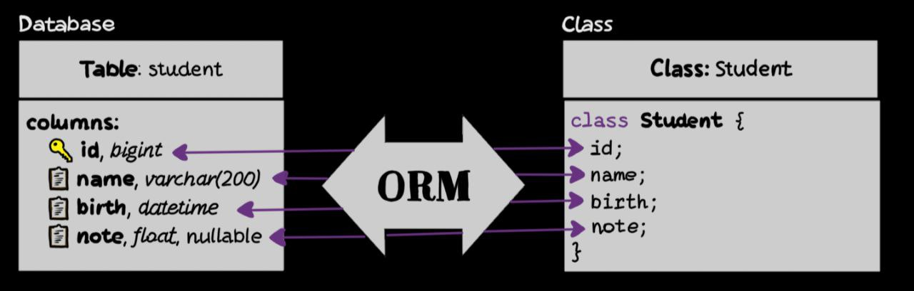

# Введение в ORM

Прежде чем перейти к следующему разделу, давайте рассмотрим, что такое ORM и почему этот паттерн широко используется в разработке программного обеспечения.

_ORM (Object-Relational Mapping)_ — это паттерн проектирования, который позволяет взаимодействовать с базой данных через объектно-ориентированный подход [^1]. С помощью ORM данные в базе данных представляются в виде объектов, что значительно упрощает процесс работы с ними, позволяя разработчикам манипулировать данными, используя привычные объекты и методы своего языка программирования, вместо того чтобы писать SQL-запросы напрямую [^2].

Этот подход особенно популярен в веб-разработке, поскольку большинство современных фреймворков поддерживают и используют ORM для упрощения работы с базами данных.

## Как работает ORM?

Представим, что у нас есть таблица `users` в базе данных:

```sql
CREATE TABLE users (
    id SERIAL PRIMARY KEY,
    name VARCHAR(255),
    email VARCHAR(255)
);
```

Чтобы получить всех пользователей из этой таблицы, стандартный SQL-запрос в Node.JS (Express) будет выглядеть так:

```javascript
const { Pool } = require('pg');

const pool = new Pool({
  // параметры подключения
});

app.get('/users', async (req, res) => {
  try {
    const result = await pool.query('SELECT * FROM users');
    res.json(result.rows);
  } catch (err) {
    console.error(err);
    res.status(500).send('Server Error');
  }
});
```

С ORM, напротив, мы можем представить таблицу `users` как класс `User` и использовать методы этого класса для взаимодействия с данными:

```js
// Получение всех пользователей
let user = Users.findAll();

// Создание нового пользователя
let newUser = Users.create({ name: 'John Doe', email: 'john.doe@example.com' });
```

- Выше представлен "псевдокод", так как синтаксис может различаться в зависимости от используемой ORM-библиотеки.

Библиотека ORM сама сформирует и выполнит эквивалентный SQL-запрос за кулисами, а в код вернёт объект пользователя. Таким образом, программный код остаётся чисто на языке высокого уровня, а общение с базой происходит "_под капотом_".



_Рисунок 1. Концептуальная схема работы ORM_

На рисунке 1 показана концептуальная схема работы ORM.

Как правило, каждому классу модели соответствует своя таблица в базе, каждому свойству объекта – отдельная колонка, а каждому экземпляру объекта – строка (запись) в таблице

Процесс сопоставления объектов с данными в базе данных называется _маппингом_ (mapping, рус. _отображение_). Маппинг позволяет _перевести данные из базы данных в объекты и наоборот_. ORM библиотеки обычно предоставляют инструменты для создания таких маппингов, что позволяет разработчикам сосредоточиться на бизнес-логике приложения, а не на деталях взаимодействия с базой данных.

## Преимущества и недостатки использования ORM

| Преимущества ORM                            | Недостатки ORM                                           |
| ------------------------------------------- | -------------------------------------------------------- |
| Упрощение работы с базой данных             | Может снижать производительность                         |
| Ускорение процесса разработки               | Не всегда понятно, что происходит "под капотом"          |
| Повышение безопасности при работе с данными | Может быть сложно оптимизировать запросы                 |
| Читаемость и поддерживаемость кода          | Может не подходить для работы с большими объемами данных |

В целом, использование ORM может значительно упростить процесс разработки и повысить производительность команды, особенно в маленьких и средних проектах. Однако важно учитывать потенциальные недостатки и выбирать подходящий инструмент в зависимости от конкретных требований проекта. В больших проектах, где запросы могут быть сложными (например, 1000+ строк SQL), ORM библиотеки могут быть менее эффективными, и в таких случаях может быть предпочтительнее использовать нативные SQL-запросы.

## Использование библиотеки ORM Sequelize с PostgreSQL

Рассмотрим на практике, как выглядит работа с ORM на примере библиотеки _Sequelize_ для _Node.js_. Мы выбрали Sequelize благодаря ее популярности и поддержке сообществом. Предположим, мы разрабатываем приложение (на языке JavaScript/TypeScript) с базой данных PostgreSQL и хотим использовать Sequelize для взаимодействия с ней.

### Установка и подключение Sequelize к PostgreSQL

В каталоге проекта установите `Sequelize` через `npm` и пакет драйвера для `PostgreSQL` – библиотеку `pg`.

```bash
npm install --save sequelize
npm install --save pg
```

После установки в `package.json` появятся зависимости `sequelize` и `pg`.

После установки, необходимо инициализировать `Sequelize` в вашем проекте.

Создайте файл `config/db.js` в вашем проекте, где будет выполняться подключение Sequelize. Импортируйте конструктор Sequelize и инициализируйте новое подключение:

```javascript
// config/db.js

import { Sequelize } from 'sequelize';

// Параметры подключения к БД:
const sequelize = new Sequelize('myapp_db', 'db_user', 'db_password', {
  host: 'localhost',
  dialect: 'postgres',
});

export default sequelize;
```

В конструктор Sequelize мы передаем:

- имя базы данных,
- имя пользователя,
- пароль
- объект с настройками подключения:
  - указываем хост (например, `localhost`)
  - диалект базы ('`postgres`' для PostgreSQL, '`mysql`' для MySQL и т.д.)

_Примечание_: В реальных проектах рекомендуется хранить параметры подключения в переменных окружения для безопасности (_показано в предыдущей главе_).

После создания экземпляра sequelize рекомендуется проверить соединение. Это можно сделать с помощью метода .authenticate():

```javascript
// config/db.js

import { Sequelize } from 'sequelize';

const sequelize = new Sequelize(/* параметры подключения к БД */);

// Проверка соединения
try {
  await sequelize.authenticate();
  console.log('Connection has been established successfully.');
} catch (error) {
  console.error('Unable to connect to the database:', error);
}

export default sequelize;
```

Если вы видите в консоли сообщение об успешном соединении, значит настройки правильные и Sequelize подключился к PostgreSQL. В противном случае будет выброшена ошибка – проверьте параметры подключения (имя хоста, пользователя, пароль, название базы) и доступность самого PostgreSQL-сервера.

### Структура проекта Node.js с использованием Sequelize

Организация файлов и папок проекта поможет поддерживать код в порядке. Ниже представлен пример структуры проекта Node.js (например, на базе Express.js) с интеграцией Sequelize и PostgreSQL. Основная структура проекта была рассмотрена в предыдущих главах, расширим её для работы с ORM:

```
myapp/
├── app.js
├── config/
│   └── db.js          # Конфигурация подключения к БД (Sequelize)
├── models/            # Папка для моделей Sequelize
│   └── User.js       # Пример модели пользователя
├── routes/
│   └── userRoutes.js  # Маршруты для работы с пользователями
├── controllers/
│   └── userController.js # Логика обработки запросов пользователей
├── package.json
└── ...                # Другие файлы и папки проекта
```

### Определение моделей данных

Чтобы работать с таблицами в базе данных через Sequelize, необходимо определить модели, то есть класс, который будет представлять таблицу в базе данных.

_Модель в Sequelize_ — это класс (или описанный через функцию define объект), соответствующий таблице. Модель определяет название таблицы и набор колонок с их типами данных и ограничениями. Например, создадим модель для пользователей (`User`) с полями `firstName` и `lastName`:

```javascript
// models/User.js

// Импортируем конструкторы DataTypes для описания типов:
import { DataTypes } from 'sequelize';
import sequelize from '../config/db.js'; // Импортируем инициализированный экземпляр Sequelize

export const User = sequelize.define('User', {
  firstName: {
    type: DataTypes.STRING,
    allowNull: false,
  },
  lastName: {
    type: DataTypes.STRING,
  },
  email: {
    type: DataTypes.STRING,
    allowNull: false,
    unique: true,
    validate: {
      isEmail: true,
    },
  },
  birthDate: {
    type: DataTypes.DATEONLY,
    allowNull: true,
  },
});
```

При объявлении модели `sequelize.define()` автоматически создаст первичный ключ (auto-increment) в таблице с именем `id`, если не указано иное.

Чтобы переименовать или настроить первичный ключ, можно явно определить поле `id` в определении модели:

```js
id: {
  type: DataTypes.INTEGER,
  primaryKey: true,
  autoIncrement: true,
},
```

> Поле не будет добавлено автоматически, если не указано `primaryKey: true`.

Вызов `sequelize.define('User', { ... })` возвращает модель `User`, которую затем можно использовать для запросов. В определении модели мы перечисляем поля (атрибуты) таблицы и их свойства:

- `type` указывает тип данных колонки в базе. Sequelize предоставляет множество встроенных типов через объект `DataTypes`.
- `allowNull: false` означает, что колонка не может быть пустой (NOT NULL).
- `unique: true` добавляет ограничение уникальности для колонки.
- `validate` позволяет задать дополнительные проверки (например, `isEmail` проверяет, что значение является корректным email).
- и другие свойства, такие как `defaultValue`, `primaryKey`, `autoIncrement` и т.д.

Sequelize автоматически позаботится о создании соответствующих столбцов в таблице, когда мы синхронизируем модель с базой. Если таблица в базе называется иначе, чем модель, можно задать опцию `tableName` в третьем аргументе `define`.

По умолчанию Sequelize pluralizes название модели – т.е. модель User будет связана с таблицей `Users`. Чтобы отключить это поведение, можно использовать опцию `freezeTableName: true`.

После определения модели, если база данных изначально пуста, можно создать таблицы, вызвав метод синхронизации. Например, `await sequelize.sync()` создаст в базе таблицы для всех определенных моделей, если их еще нет. Если база данных и таблицы уже существуют, то вызов `sync()` не нужно выполнять.

В более продвинутых сценариях используют миграции (папка `migrations/`), чтобы контролировать изменения схемы.

### Работа с данными через модели

Sequelize предоставляет удобные методы для выполнения стандартных операций CRUD: создание записей (`Create`), чтение/выборка (`Read`), обновление (`Update`) и удаление (`Delete`). Рассмотрим каждую из них на примере модели `User`. Все эти методы являются асинхронными и возвращают Promise, поэтому будем вызывать их с await (в async-функции) для удобства.

#### Создание записей (INSERT)

Для добавления новой строки в таблицу используется метод `create()`. Он вызывается на модели и в него передается объект с данными новой записи. Например, создадим нового пользователя:

```js
const jane = await User.create({ firstName: 'Jane', lastName: 'Doe' });
console.log('Новый пользователь ID:', jane.id);
```

Этот код выполнит SQL-запрос `INSERT INTO "Users" ("firstName", "lastName", "createdAt", "updatedAt") VALUES ('Jane', 'Doe', NOW(), NOW()) RETURNING *;` и вернет созданный объект пользователя с заполненным полем `id`.

Если в модели определены поля, которые нельзя задавать напрямую (например, флаг администратора), метод `create` позволяет указать опцию `fields`, чтобы ограничить список полей для вставки. Это повышает безопасность при создании записей на основе пользовательского ввода.

#### Чтение данных (SELECT)

Для выборки данных используются методы-«файндеры», такие как `findAll()`, `findOne()`, `findByPk()` и другие. Они позволяют гибко фильтровать, сортировать и ограничивать результаты.

Например, чтобы получить всех пользователей:

```js
const users = await User.findAll();

console.log(`Найдено пользователей: ${users.length}`);

users.forEach((user) => {
  console.log(user.firstName, user.lastName);
});
```

Эта команда выполнит SQL-запрос `SELECT * FROM "Users";` и вернет массив объектов пользователей.

Часто необходимо выбирать не все записи, а по определенному условию (аналог SQL `where`). В методах Sequelize для этого предусмотрен параметр where. Например, чтобы получить всех пользователей с фамилией 'Doe':

```js
const doeUsers = await User.findAll({
  where: { lastName: 'Doe' },
});
// Выполнится SQL: SELECT * FROM Users WHERE lastName = 'Doe';
```

Объект where позволяет задавать условия – в простейшем случае совпадение значения поля. Sequelize также поддерживает различные операторы (например, сравнение, `LIKE`, `BETWEEN` и т.д.) через синтаксис вида `[Op.gt]`, `[Op.like]` и др., но в базовом случае достаточен объект с полями и значениями.

```javascript
import { Op } from 'sequelize';
const recentUsers = await User.findAll({
  where: {
    createdAt: {
      [Op.gt]: new Date(new Date() - 24 * 60 * 60 * 1000), // созданные за последние 24 часа
    },
  },
});
```

Другие методы выборки:

- `findOne()` – находит одну запись (первую, удовлетворяющую условию). Если ничего не найдено, вернет `null`.
  ```js
  const user = await User.findOne({ where: { email: 'jane.doe@example.com' } });
  if (user) {
    console.log(user.firstName, user.lastName);
  } else {
    console.log('Пользователь не найден');
  }
  ```
- `findByPk()` – находит запись по первичному ключу (ID).
  ```js
  const user = await User.findByPk(1); // Найти пользователя с ID=
  if (user) {
    console.log(user.firstName, user.lastName);
  } else {
    console.log('Пользователь не найден');
  }
  ```
- `findOrCreate()` – пытается найти запись по условию и, если не нашел, создает новую
  ```js
  const [user, created] = await User.findOrCreate({
    where: { email: 'jane.doe@example.com' },
    defaults: { firstName: 'Jane', lastName: 'Doe' },
  });
  console.log(user.id, created ? 'Создан новый пользователь' : 'Пользователь найден');
  ```

Эти методы упрощают типичные операции поиска в базе.

#### Обновление записей (UPDATE)

Обновление существующих записей выполняется методом `update()`, который вызывается на модели. В метод передаются два аргумента: объект с новыми значениями полей и объект `where` для выбора записей, которые нужно обновить. Например, установим для всех пользователей без фамилии значение фамилии "Doe":

```js
await User.update({ lastName: 'Doe' }, { where: { lastName: null } });
// Выполнится SQL: UPDATE "Users" SET "lastName"='Doe' WHERE "lastName" IS NULL;
```

Этот вызов сгенерирует SQL UPDATE запрос, обновляющий поле `lastName` на "Doe" во всех строках, где `lastName IS NULL`.

Метод `update` возвращает массив с числом затронутых строк. То есть успешность операции можно проверить так:

```js
const [affectedCount] = await User.update({ lastName: 'Doe' }, { where: { lastName: null } });
if (affectedCount > 0) {
  console.log(`Обновлено записей: ${affectedCount}`);
} else {
  console.log('Записи для обновления не найдены');
}
```

Если нужно обновить конкретную запись и получить обновленный объект, можно использовать `instance.save()` на объекте, либо добавить опцию `{ returning: true }` в `update` (PostgreSQL позволит вернуть обновленные строки).

```js
const user = await User.findByPk(1);

if (user) {
  user.lastName = 'Smith';
  await user.save(); // Сохранит изменения в базе
  console.log('Пользователь обновлен:', user);
}
```

#### Удаление записей (DELETE)

Для удаления записей используется метод `destroy()`. Как и в случае обновления, в него обычно передают условие `where` для указания, какие записи удалить. Например, удалим всех пользователей с именем "Jane":

```js
await User.destroy({
  where: { firstName: 'Jane' },
});
// Выполнится SQL: DELETE FROM "Users" WHERE "firstName"='Jane';
```

Этот код сформирует SQL запрос на удаление всех строк, где `firstName` равно "Jane" и удалит все строки, удовлетворяющие условию. Как и в случае с `update`, метод `destroy` возвращает количество удаленных строк, что позволяет проверить успешность операции:

```js
const deletedCount = await User.destroy({ where: { firstName: 'Jane' } });
console.log(`Удалено пользователей: ${deletedCount}`);
```

#### Дополнительные опции запросов

Sequelize предоставляет и другие полезные опции для запросов: например, attributes (выбор конкретных столбцов вместо всех), `order` (сортировка результатов), `limit` и `offset` (пагинация), агрегирующие функции через `sequelize.fn` и т.п. Однако, в рамках основы CRUD, вышеописанных методов достаточно для большинства типовых операций.

```js
const users = await User.findAll({
  attributes: ['firstName', 'lastName'], // Выбрать только эти поля
  where: { lastName: 'Doe' },
  order: [['createdAt', 'DESC']], // Сортировка по дате создания, по убыванию
  limit: 10, // Максимум 10 записей
  offset: 0, // Пропустить первые 0 записей (для пагинации)
});
```

### Связи между моделями (ассоциации)

Из курса по базам данных вы уже знаете, что в реляционных базах данных можно создавать связи между таблицами. Это позволяет объединять данные из разных таблиц и использовать их вместе, избегая дублирования данных и таким образом нормализуя структуру базы данных.

Когда мы говорим о связях в контексте ORM, то они устроены схожим образом с тем, как вы привыкли видеть их в реляционных базах данных.

Поскольку с ORM появляется дополнительный слой абстракции — модели, мы будем рассматривать два типа связей:

- _Между таблицами в базе данных_ - это те связи, которые вы изучали на курсе по базам данных.
- _Между моделями в Laravel_ это связи, которые возникают при работе с ORM и которые позволяют нам легко получать связанные данные.

В Sequelize есть несколько типов связей между моделями. Основные из них:

- Один-к-одному (One-to-One)
- Один-ко-многим (One-to-Many)
- Многие-ко-многим (Many-to-Many)

Рассмотрим на примере, как задаются связи между моделями в Sequelize.

#### Один-ко-многим (One-to-Many) и Один-к-одному (One-to-One)

Предположим, у нас есть модель `User` и добавим модель `Post` (публикация, статья), которую создают пользователи.

Логично, что один пользователь может иметь много постов, а каждый пост принадлежит какому-то одному пользователю. Такая связь называется "_один-ко-многим_".

В Sequelize она задается парой методов: на стороне "один" вызывается `hasMany`, а на стороне "много" – `belongsTo`.

```js
// models/Post.js
// Определим модель Post для примера
const Post = sequelize.define('Post', {
  title: DataTypes.STRING,
  content: DataTypes.TEXT,
});

Post.belongsTo(User); // У каждого Post есть один User (владелец)
```

В модели `User` добавим:

```js
// models/User.js

// Определение модели User (продолжение)

User.hasMany(Post); // У User может быть много Post
```

В примере выше, мы указали связь между моделями `User` и `Post`.

_В данной связи_:

- Одна модель имеет другую (`User` имеет много `Post`).
- Другая модель принадлежит первой (`Post` принадлежит одному `User`).

Важно понимать, что если одна модель имеет другую модель, то эта модель, в свою очередь, принадлежит первой.

> Лайфхак. Если сложно определить, кто использует `belongsTo`, а кто `hasMany`, то можно ориентироваться на внешний ключ. Функция `belongsTo` добавляет в модель, на которой она вызвана, внешний ключ (например, `userId` в таблице `Posts`), указывающий на связанную запись в другой таблице. В свою очередь, `hasMany` просто обозначает связь и не добавляет ключ. То есть, если нам необходимо, чтобы в таблице `Posts` был внешний ключ `userId`, то `Post` должен вызывать `belongsTo(User)`.

После этого Sequelize ожидает, что в таблице Posts будет внешний ключ, связывающий пост с пользователем. По умолчанию он назовется `UserId` (если не переопределить).

Аналогично задается связь "один-к-одному": используется комбинация `hasOne` и `belongsTo`. Например, если бы у пользователя был один профиль `Profile`:

```js
User.hasOne(Profile);
Profile.belongsTo(User);
```

Как думаете, в данном случае, в какой таблице будет внешний ключ?

<details>
  <summary>Ответ</summary>
  В таблице `Profiles` будет внешний ключ `UserId`, так как `Profile` вызывает `belongsTo(User)`.
</details>

Чтобы переименовать внешний ключ, можно использовать опцию `foreignKey` в ассоциациях:

```js
Post.belongsTo(User, { foreignKey: 'authorId' });
User.hasMany(Post, { foreignKey: 'authorId' });
```

`foreignKey` необходимо указывать и в `belongsTo`, и в `hasMany`, чтобы обе модели использовали одно и то же имя внешнего ключа.

Так же можно указать дополнительные опции, например, `onUpdate`, `onDelete` для управления поведением при обновлении или удалении связанных записей:

- `onDelete: 'CASCADE'` – при удалении пользователя будут удалены все его посты.
- `onUpdate: 'CASCADE'` – при изменении ID пользователя, внешний ключ в постах также обновится.
- `onDelete: 'SET NULL'` – при удалении пользователя, внешний ключ в постах будет установлен в NULL.
- `onDelete: 'RESTRICT'` – запретит удаление пользователя, если у него есть связанные посты.

```js
Post.belongsTo(User, { foreignKey: 'authorId', onDelete: 'CASCADE' });
User.hasMany(Post, { foreignKey: 'authorId', onDelete: 'CASCADE' });
```

#### Многие-ко-многим (Many-to-Many)

В случае связи "_многие-ко-многим_" каждая запись в одной таблице может быть связана с несколькими записями в другой таблице и наоборот. Для связи многие-ко-многим в Sequelize используется метод `belongsToMany` на обеих моделях. Эта связь требует наличия _промежуточной таблицы_ (таблицы связей), которая хранит пары идентификаторов связанных записей.

Например, у нас есть модели `Post` и `Tag` (тег). Один пост может иметь много тегов, и один тег может быть связан с многими постами. Такая связь называется "_многие-ко-многим_".

```js
// models/Tag.js
const Tag = sequelize.define('Tag', {
  name: DataTypes.STRING,
});

Tag.belongsToMany(Post, { through: 'PostTags' }); // Связь Tag
```

```js
// models/Post.js
Post.belongsToMany(Tag, { through: 'PostTags' }); // Связь Post
```

Параметр `through` указывает имя промежуточной таблицы (или модель) для хранения связей. Эта команда создаст (или переиспользует, если существует) таблицу PostTags с колонками внешних ключей, например `postId` и `tagId`, связывающими записи. Для связи многие-ко-многим необходимо вызвать `belongsToMany` у обеих моделей.

Для переименования колонок в промежуточной таблице можно использовать опции `foreignKey` и `otherKey`. Например: `post_id` и `tag_id`.

```js
Post.belongsToMany(Tag, { through: 'PostTags', foreignKey: 'post_id', otherKey: 'tag_id' });
Tag.belongsToMany(Post, { through: 'PostTags', foreignKey: 'tag_id', otherKey: 'post_id' });
```

#### Получение связанных данных (Eager Loading)

После определения связей между моделями, Sequelize позволяет легко получать связанные данные с помощью опции `include` в методах выборки. Это называется _жадной загрузкой_ (Eager Loading). Например, чтобы получить всех пользователей вместе с их постами:

```js
const usersWithPosts = await User.findAll({
  include: Post, // Включить связанные посты
});

usersWithPosts.forEach((user) => {
  console.log(user.firstName, user.lastName);
  user.Posts.forEach((post) => {
    console.log(' -', post.title);
  });
});
```

- Если не указать `include`, связанные данные не будут загружены. То есть будет загружен только пользователь без его постов.

В `include` можно передавать массив моделей, если нужно загрузить несколько связей.

```js
const usersWithPostsAndProfiles = await User.findAll({
  include: [Post, Profile], // Включить посты и профиль
});
```

Получение данных многих-ко-многим также поддерживается через `include`:

```js
const postsWithTags = await Post.findAll({
  include: Tag, // Включить связанные теги
});

// либо наоборот
const tagsWithPosts = await Tag.findAll({
  include: Post, // Включить связанные посты
});
```

#### Проблема N+1 запросов

При использовании жадной загрузки важно учитывать проблему N+1 запросов.

Если вы загружаете список пользователей и для каждого пользователя отдельно загружаете его посты, это приведет к большому количеству запросов к базе данных (N запросов на пользователей + 1 запрос на посты). То есть, например, у вас есть 10 пользователей и вам необходимо получить связанные данные (посты) для каждого из них. Если вы не используете жадную загрузку, то для каждого пользователя будет выполнен отдельный запрос к базе данных для получения его постов:

```sql
SELECT * FROM "Users"; -- 1 запрос на получение всех пользователей
SELECT * FROM "Posts" WHERE "userId" = 1; -- 1 запрос на получение постов первого пользователя
SELECT * FROM "Posts" WHERE "userId" = 2; -- 1 запрос на получение постов второго пользователя
...
SELECT * FROM "Posts" WHERE "userId" = 10; -- 1 запрос на
```

Если же использовать жадную загрузку с `include`, Sequelize выполнит всего два запроса:

```sql
SELECT * FROM "Users"; -- 1 запрос на получение всех пользователей
SELECT * FROM "Posts" WHERE "userId" IN (1, 2, ..., 10); -- 1 запрос на получение постов всех пользователей
```

Это значительно уменьшает количество запросов и повышает производительность.

Подробнее о Sequelize и его возможностях можно узнать в официальной документации: https://sequelize.org/docs/v6/getting-started/ [^4]

## Миграции в Sequelize

Тема миграции была рассмотрена в предыдущей главе. В Sequelize миграции реализованы через отдельный пакет `sequelize-cli`, который позволяет создавать, запускать и откатывать миграции из командной строки.

Для установки `sequelize-cli` выполните команду:

```bash
npm install --save-dev sequelize-cli
```

После установки в `package.json` появится зависимость `sequelize-cli`.

Создайте файл конфигурации `config/config.json`, в котором укажите параметры подключения к базе данных для разных сред (development, test, production):

```json
{
  "development": {
    "username": "db_user",
    "password": "db_password",
    "database": "myapp_db",
    "host": "localhost",
    "dialect": "postgres"
  },
  "test": {
    "username": "db_user",
    "password": "db_password",
    "database": "myapp_test_db",
    "host": "localhost",
    "dialect": "postgres"
  },
  "production": {
    "username": "db_user",
    "password": "db_password",
    "database": "myapp_prod_db",
    "host": "localhost",
    "dialect": "postgres"
  }
}
```

После этого можно инициализировать структуру каталогов для миграций командой:

```bash
npx sequelize-cli init
```

Эта команда создаст папки `models`, `migrations`, `seeders`.

После инициализации можно создавать первую модель:

```bash
npx sequelize-cli model:generate --name User --attributes firstName:string,lastName:string,email
```

Эта команда создаст:

- файл миграции в папке `migrations/`
- файл модели в папке `models/`.

В файле миграции будет SQL-код для создания таблицы `Users` с указанными полями.

```js
// migrations/XXXXXXXXXXXXXX-create-user.js
'use strict';

module.exports = {
  up: async (queryInterface, Sequelize) => {
    await queryInterface.createTable('Users', {
      id: {
        allowNull: false,
        autoIncrement: true,
        primaryKey: true,
        type: Sequelize.INTEGER,
      },
      firstName: {
        type: Sequelize.STRING,
      },
      lastName: {
        type: Sequelize.STRING,
      },
      email: {
        type: Sequelize.STRING,
      },
      createdAt: {
        allowNull: false,
        type: Sequelize.DATE,
      },
      updatedAt: {
        allowNull: false,
        type: Sequelize.DATE,
      },
    });
  },
  down: async (queryInterface, Sequelize) => {
    await queryInterface.dropTable('Users');
  },
};
```

В файле модели будет определение модели `User`, аналогичное тому, что мы делали вручную ранее.

```js
// models/user.js
'use strict';

const { Model } = require('sequelize');

module.exports = (sequelize, DataTypes) => {
  class User extends Model {
    static associate(models) {
      User.hasMany(models.Post, { foreignKey: 'userId' });
    }
  }

  User.init(
    {
      firstName: DataTypes.STRING,
      lastName: DataTypes.STRING,
      email: DataTypes.STRING,
    },
    {
      sequelize,
      modelName: 'User',
    },
  );
  return User;
};
```

- Примечание: В современном JS рекомендуется использовать ESM-модули (import/export) вместо CommonJS (require/module.exports). Однако `sequelize-cli` по умолчанию генерирует файлы в формате CommonJS. Чтобы использовать ESM, потребуется дополнительная настройка.

```js
// models/User.js

import { Model, DataTypes } from 'sequelize';

export default (sequelize) => {
  class User extends Model {
    static associate(models) {
      User.hasMany(models.Post, { foreignKey: 'userId' });
    }
  }

  User.init(
    {
      firstName: DataTypes.STRING,
      lastName: DataTypes.STRING,
      email: DataTypes.STRING,
    },
    {
      sequelize,
      modelName: 'User',
    },
  );
  return User;
};
```

Чтобы применить миграции и создать таблицы в базе данных, выполните команду:

```bash
npx sequelize-cli db:migrate
```

Эта команда выполнит все миграции, которые еще не были применены, и создаст таблицы в базе данных.

Чтобы откатить последнюю миграцию, используйте команду:

```bash
npx sequelize-cli db:migrate:undo
```

Чтобы перезапустить все миграции (откатить все и применить заново), выполните:

```bash
npx sequelize-cli db:migrate:undo:all
npx sequelize-cli db:migrate
```

Дополнительно можно создавать сиды (начальные данные) с помощью команды.

```bash
npx sequelize-cli seed:generate --name demo-user
```

> Более подробно о миграциях и сидерах в Sequelize можно узнать в официальной документации: https://sequelize.org/docs/v6/other-topics/migrations/

## Немного о Prisma ORM

Напоследок отметим, что помимо Sequelize существует и другая популярная ORM – _Prisma_. _Prisma_ предлагает более современный подход: вы описываете модель данных в специальном schema-файле, а ORM генерирует на основе него типизированный клиент для базы. В то время как Sequelize представляет классический ORM (таблицы соответствуют классам моделей, объекты моделей предоставляют методы для CRUD во время выполнения), Prisma фокусируется на типобезопасности и генерации кода.

Prisma пытается решить некоторые проблемы традиционных ORM, такие как избыточность моделей, смешивание логики хранения с бизнес-логикой, отсутствие статической типизации и т.д.

Подробнее о Prisma можно узнать в официальной документации: https://prisma.io/docs/

[^1]: _What is an ORM – The Meaning of Object Relational Mapping Database Tools_. freeCodeCamp [online]. Avaiable at: https://www.freecodecamp.org/news/what-is-an-orm-the-meaning-of-object-relational-mapping-database-tools/
[^2]: _Object-Relational Mapping Explained: Benefits, Drawbacks & Tools_. cdata.com [online]. Available at: https://www.cdata.com/blog/object-relational-mapping
[^3]: _Object-Relational Mapping (ORM) Explained with Examples_. altexsoft.com [online]. Available at: https://www.altexsoft.com/blog/orm-object-relational-mapping/
[^4]: _Getting Started_. sequelize.org [online]. Available at: https://sequelize.org/docs/v6/getting-started/
