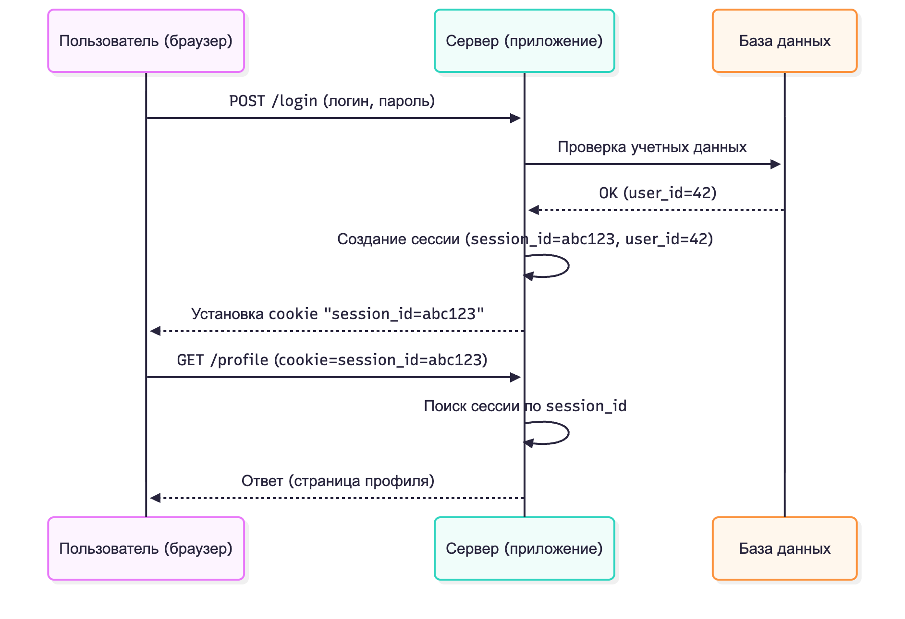
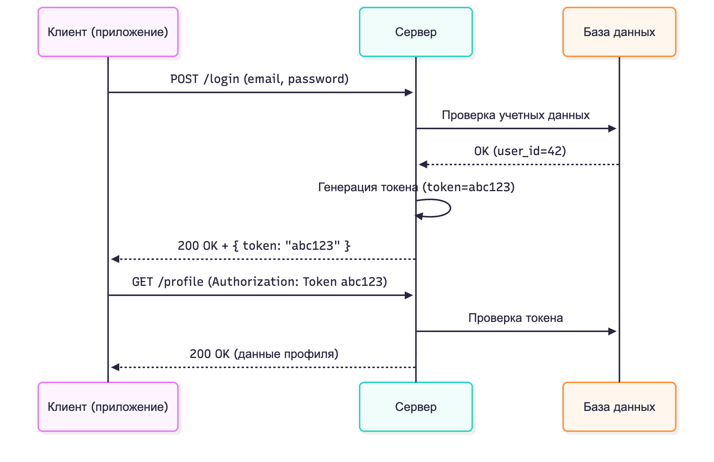
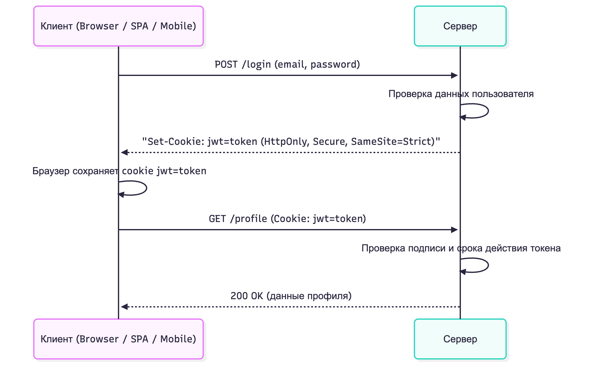
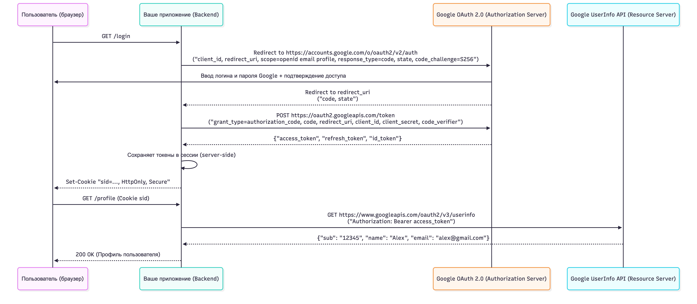
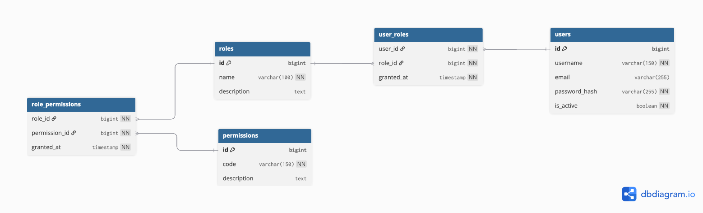

# Аутентификация и авторизация в бэкенд-приложениях

## Содержание

- [Аутентификация и авторизация в бэкенд-приложениях](#аутентификация-и-авторизация-в-бэкенд-приложениях)
  - [Содержание](#содержание)
  - [Аутентификация vs авторизация](#аутентификация-vs-авторизация)
  - [Методы аутентификации в веб-приложениях](#методы-аутентификации-в-веб-приложениях)
    - [Сессионная аутентификация (Session-Based)](#сессионная-аутентификация-session-based)
      - [Принцип работы](#принцип-работы)
      - [Последовательность работы](#последовательность-работы)
      - [Псевдокод](#псевдокод)
    - [Токен-авторизация (Token-Based)](#токен-авторизация-token-based)
      - [Принцип работы](#принцип-работы-1)
      - [Последовательность работы](#последовательность-работы-1)
      - [Хранение токенов](#хранение-токенов)
      - [Преимущества токен-авторизации](#преимущества-токен-авторизации)
      - [Псевдокод](#псевдокод-1)
    - [JWT (JSON Web Tokens)](#jwt-json-web-tokens)
      - [Основная идея](#основная-идея)
      - [Структура JWT](#структура-jwt)
      - [Последовательность работы](#последовательность-работы-2)
      - [Аспекты безопасности](#аспекты-безопасности)
      - [Псевдокод](#псевдокод-2)
    - [SSO (Single Sign-On). OAuth](#sso-single-sign-on-oauth)
      - [Принцип работы](#принцип-работы-2)
      - [OAuth 2.0 — основа SSO](#oauth-20--основа-sso)
    - [Заключение](#заключение)
  - [Аутентификация пользователей в Express (Node.js)](#аутентификация-пользователей-в-express-nodejs)
    - [Вариант 1: Самостоятельная реализация (без готовых auth-фреймворков)](#вариант-1-самостоятельная-реализация-без-готовых-auth-фреймворков)
    - [Вариант 2: Использование готовых библиотек. Passport.js](#вариант-2-использование-готовых-библиотек-passportjs)
      - [Пример использования Passport с JWT](#пример-использования-passport-с-jwt)
  - [Авторизация в бэкенд-приложениях](#авторизация-в-бэкенд-приложениях)
    - [Типы авторизации](#типы-авторизации)
    - [Role-Based Access Control (RBAC)](#role-based-access-control-rbac)
    - [Авторизация (RBAC) в Express-приложениях](#авторизация-rbac-в-express-приложениях)

## Аутентификация vs авторизация

Прежде чем углубляться в детали, напомним различие между этими понятиями.

_Аутентификация_ – это проверка личности пользователя (кто он такой), а _авторизация_ – определение его прав (что ему разрешено делать). Например, компания Okta коротко формулирует: «Authentication confirms that users are who they say they are. Authorization gives those users permission to access a resource» [^1]. Проще говоря, при входе в систему вы сначала подтверждаете свою личность (аутентификация), а затем система решает, какие ресурсы или действия вам разрешены (авторизация).

В реальной жизни это похоже на посещение офиса: представьте, что вы входите в защищенное здание. Вам нужно предъявить пропуск охраннику – это этап аутентификации (подтверждение личности). После этого вас пускают внутрь, но только в те комнаты, к которым у вас есть доступ – это уже авторизация (проверка прав доступа).

Зная разницу между этими шагами, перейдем к тому, как они реализуются в серверных приложениях.

## Методы аутентификации в веб-приложениях

Существует несколько распространенных методов аутентификации в веб-приложениях:

### Сессионная аутентификация (Session-Based)

Одним из наиболее распространённых и традиционных методов аутентификации в веб-приложениях является использование _сессий_ (sessions) и _куки_ (cookies). Этот подход применяется во многих фреймворках и системах управления пользователями и остаётся стандартом для классических серверных приложений, таких как WordPress, Laravel, Symfony и другие.

#### Принцип работы

После успешной аутентификации (например, при вводе правильного логина и пароля) сервер создаёт уникальную сессию, которая хранит данные о пользователе - например, его ID, роль, токен CSRF или другие параметры состояния.

Сессия _сохраняется на сервере_. Она может быть сохранена в файле, в базе данных или в памяти сервера, где ключ - это уникальный идентификатор сессии, а значение - данные пользователя. Клиенту (браузеру) отправляется специальная кука с уникальным идентификатором сессии (`session_id`).

При каждом последующем запросе браузер автоматически отправляет эту куку серверу, и сервер по идентификатору находит соответствующую сессию и определяет, какой пользователь выполняет запрос.

#### Последовательность работы

Алгоритм работы сессионной аутентификации можно описать следующим образом:

1. Пользователь вводит логин ("user123") и пароль ("password").
2. Сервер проверяет данные и, если они верны, создаёт сессию:
3. Генерируется уникальный идентификатор сессии (например, `abc123xyz`).
4. Сессия сохраняется на сервере с данными пользователя, например, файл `sessions/abc123xyz` содержит `{ userId: 1, role: 'admin' }`.
5. Сервер отправляет клиенту куку с идентификатором сессии: `Set-Cookie: session_id=abc123xyz; HttpOnly; Secure; SameSite=Strict`.
6. При последующих запросах клиент отправляет куку: `Cookie: session_id=abc123xyz`.
7. Сервер получает запрос, извлекает `session_id` из куки, находит соответствующую сессию и определяет пользователя.
   1. Сервер может выполнять дополнительный запрос к базе данных для получения актуальной информации о пользователе, если это необходимо.
8. Запрос обрабатывается с учётом прав пользователя, хранящихся в сессии.

Сессионная аутентификация требует хранения информации о каждой активной сессии на сервере, поэтому ее называют состоято-ориентированной (_stateful_) – сервер помнит состояние (сессию) каждого пользователя. Сессии обычно имеют время жизни и требуют механизма удаления истекших сессий, чтобы не перегружать сервер.



_Рисунок 1. Сессионная аутентификация_

#### Псевдокод

```js
// Маршрут логина
app.post("/login", (req, res) => {
  const user = db.find(req.body.email);
  if (!user) return res.status(401);

  const sid = randomId();
  sessions[sid] = user.id; // сервер хранит сессию
  res.cookie("sid", sid, { httpOnly: true });
});

// Middleware для защиты маршрутов
function auth(req, res, next) {
  const sid = req.cookies.sid;
  if (!sessions[sid]) return res.status(401);
  req.user = db.findById(sessions[sid]);
  next();
}
```

Однако, данный способ плохо подходит для масштабируемых распределённых систем, где несколько серверов обрабатывают запросы, так как необходимо синхронизировать состояние сессий между серверами.

> Данный способ был рассмотрен в курсе по веб-разработке и является базовым для многих приложений.

### Токен-авторизация (Token-Based)

_Token-Based Authentication_ - это метод аутентификации, при котором после успешного входа пользователю выдается специальный токен (token), который затем используется для подтверждения подлинности при всех последующих запросах к серверу.

Данный токет называется _access token_ (токен доступа), потому, что он используется для аутентификации и получения доступа к защищённым ресурсам.

В отличие от традиционной сессионной аутентификации, где сервер хранит состояние пользователя, при токен-аутентификации вся информация о сессии передаётся клиенту, а сервер становится stateless (без состояния).

#### Принцип работы

Основная идея заключается в том, что после проверки логина и пароля сервер не сохраняет данные о пользователе в памяти или в сессии, а генерирует уникальный токен доступа (обычно в виде случайной строки или хеша), который клиент должен отправлять с каждым запросом.

Каждый запрос, сервер проверяет токен на валидность и, если он действителен, выполняет запрос от имени пользователя.

Обычно для этого в базе данных хранится таблица с активными токенами, где каждому токену соответствует пользователь и срок действия.

Этот токен служит "пропуском" в систему: если он действителен, сервер выполняет запрос от имени пользователя; если нет — возвращает ошибку авторизации.

#### Последовательность работы

1. Клиент отправляет запрос с учетными данными.

   Пример: `POST /login` с телом `{ "email": "user@example.com", "password": "secret" }`.

2. Сервер проверяет учетные данные.

   Если они корректны — создаётся токен (например, случайная строка или зашифрованный идентификатор пользователя): `"token123abc"`.

3. Сервер возвращает токен клиенту.

   Клиент сохраняет токен — обычно в `localStorage` или в куке.

4. Клиент отправляет токен при каждом запросе.

   Пример: `GET /api/data` с заголовком `Authorization: Bearer token123abc`.

   > Можно заметить, что токен передаётся в заголовке `Authorization` с префиксом `Bearer`, что является стандартной практикой.
   > Слово `Bearer` указывает, что это токен доступа (access token), который предоставляет доступ к защищённым ресурсам от имени пользователя.
   > Этот формат официально определён в спецификации RFC 6750 — The OAuth 2.0 Authorization Framework: Bearer Token Usage, и является стандартом для всех современных API и сервисов аутентификации.

5. Сервер проверяет токен.

   Если токен найден в базе или в доверенном хранилище — запрос считается аутентифицированным.



_Рисунок 2. Токен-авторизация_

#### Хранение токенов

Существует несколько способов хранения токенов на стороне клиента:

- _Local Storage_. Простой вариант для SPA-приложений. Однако уязвим для XSS-атак.
- _Cookies (с флагами Secure и HttpOnly)_.Повышает безопасность, но возвращает логику ближе к session-based auth.
- _Session Storage_. Токен хранится до закрытия вкладки. Безопаснее, но не сохраняется при перезагрузке браузера.

Чаще всего токен хранится в `localStorage`.

#### Преимущества токен-авторизации

В отличии от сессионной аутентификации, токен-авторизация обладает рядом преимуществ:

- _Mасштабируемость_. Поскольку сервер не хранит состояние сессий, его легче масштабировать горизонтально (добавлять новые серверы). То есть, любой сервер может обработать запрос, проверив токен.
- _Безопасность_. Токены могут быть настроены с ограниченным временем жизни и правами доступа, что снижает риск несанкционированного доступа.
- _Гибкость_. Токены могут использоваться для аутентификации в различных сервисах и API, что упрощает интеграцию между системами. Допустим, если бэкенд состоит из нескольки сервисов, каждый из которых требует аутентификации, токен-авторизация позволяет легко передавать токен между ними без необходимости повторной аутентификации.

#### Псевдокод

```js
// Маршрут логина
app.post("/login", (req, res) => {
  const user = db.find(req.body.email);
  if (!user) return res.status(401);

  const token = randomString();
  db.saveToken(user.id, token); // токен хранится в БД
  res.json({ token });
});

function auth(req, res, next) {
  // Получаем токен из заголовка Authorization
  const token = req.headers.authorization?.replace("Bearer ", "");
  const user = db.findByToken(token);
  if (!user) return res.status(401);
  req.user = user;
  next();
}
```

### JWT (JSON Web Tokens)

_JSON Web Token (JWT)_ — это современный и широко используемый формат токена для аутентификации и авторизации пользователей в веб-приложениях и API.

Он представляет собой компактный, самодостаточный способ безопасно передавать информацию между клиентом и сервером в виде подписанного токена.

#### Основная идея

_JWT_ это токен, содержащий всю необходимую информацию о пользователе в зашифрованном и подписанном виде.

Сервер, проверяя подпись токена, может убедиться, что данные не были изменены, без необходимости хранить состояние. То есть, нет необходимости при каждом запросе обращаться к базе данных для проверки сессии.

> Это ключевое отличие от обычных токенов: серверу не нужно искать токен в базе — достаточно проверить его подпись. Именно поэтому JWT особенно популярен в распределённых системах и микросервисах.

#### Структура JWT

JWT состоит из трёх частей, разделённых точками (`.`):

```
xxxxx.yyyyy.zzzzz
```

_Таблица 1. Структура JWT_

| Часть       | Название          | Описание                                                                    |
| :---------- | :---------------- | :-------------------------------------------------------------------------- |
| _Header_    | Заголовок         | Содержит тип токена (`JWT`) и алгоритм подписи (`HS256`, `RS256`).          |
| _Payload_   | Полезная нагрузка | Содержит данные (_claims_): ID пользователя, роль, срок действия и т.д.     |
| _Signature_ | Подпись           | Используется для проверки подлинности токена (на основе секрета или ключа). |

Пример JWT:

```
eyJhbGciOiJIUzI1NiIsInR5cCI6IkpXVCJ9.
eyJ1c2VyX2lkIjoyMiwicm9sZSI6ImFkbWluIiwiZXhwIjoxNzM5MjY4NDAwfQ.
b5jvSgD7y0eBoV1W0y3eVt7gZC9pQXx5x8XlUeJqOoE
```

Расшифровка:

```
Header:
{
  "alg": "HS256",
  "typ": "JWT"
}

Payload:
{
  "user_id": 22,
  "role": "admin",
  "exp": 1739268400
}
```

#### Последовательность работы

1. Клиент отправляет логин и пароль на сервер. Пример: `POST /login`.
2. Сервер проверяет данные и создаёт JWT.

   Токен содержит ID пользователя и срок действия, затем подписывается секретным ключом.

3. Клиент получает токен и сохраняет его (в `localStorage` или куках).
4. При каждом запросе клиент добавляет заголовок: `Authorization: Bearer <JWT>`.
5. Сервер проверяет подпись токена.

   Если подпись действительна и срок не истёк — запрос разрешается, иначе возвращается 401 Unauthorized.



_Рисунок 3. JWT аутентификация_

Главное преимущество JWT — в том, что он самодостаточен (self-contained). Вся информация, необходимая для аутентификации и авторизации, содержится внутри токена, и серверу не нужно хранить никаких данных о сессиях.

Это делает JWT:

- идеально подходящим для распределённых и микросервисных систем;
- удобным при масштабировании, так как не требуется общее хранилище сессий;
- совместимым с разными клиентами — браузерами, мобильными приложениями, API.

#### Аспекты безопасности

- _Подпись_. JWT должен быть подписан с использованием надежного алгоритма (например, HMAC SHA256 или RSA) и секретного ключа, чтобы предотвратить подделку токена.
- _Срок действия_. Важно устанавливать срок действия токена (`exp` claim), чтобы ограничить время его использования. _Стандартно токены действуют от нескольких минут до нескольких часов_. Это необходимо для снижения риска использования украденных токенов.
- _Использование нескольких токенов_. Ваш _access token_ может иметь короткий срок действия, в целях безопасности (могут быть украдены), и в данном случае пользователю придется периодически аунтентифицироваться заново (например, каждые 15 минут). Чтобы избежать частых логинов, можно использовать _refresh token_ с более длительным сроком действия (например, несколько дней). При истечении срока действия access token, клиент может использовать refresh token для получения нового access token без повторного ввода логина и пароля. Более полдробно:
  - [Про токены](https://gist.github.com/zmts/802dc9c3510d79fd40f9dc38a12bccfc)
  - [Зачем нужен Refresh Token, если есть Access Token?](https://habr.com/ru/companies/Voximplant/articles/323160/)
  - [Добавляем Refresh Token](https://habr.com/ru/articles/466929/)

#### Псевдокод

```js
// Маршрут логина
app.post("/login", (req, res) => {
  const user = db.find(req.body.email);
  if (!user) return res.status(401);

  const jwt = sign({ id: user.id }, SECRET, { exp: "1h" }); // сервер не хранит
  res.cookie("jwt", jwt, { httpOnly: true, secure: true });
});

function auth(req, res, next) {
  const token = req.cookies.jwt;
  const data = verify(token, SECRET);
  if (!data) return res.status(401);
  req.user = db.findById(data.id);
  next();
}
```

> Никогда не храните в JWT конфиденциальные данные (пароли, личную информацию), так как содержимое токена после декодирования может прочитать любой (подпись лишь предотвращает изменение, но не скрывает данные). Если нужно передать чувствительную информацию, используйте шифрование либо храните ее на сервере, а в токен включайте только ссылку/ID.

### SSO (Single Sign-On). OAuth

_SSO (Single Sign-On)_ — это технология, позволяющая пользователю войти один раз и получить доступ к нескольким приложениям или системам, не вводя пароль повторно. Например, вход через _Google_, _Facebook_ или _GitHub_ на сторонних сайтах.

#### Принцип работы

1. Пользователь нажимает кнопку "Войти через Google".
2. Его перенаправляют на страницу авторизации Google.
3. После успешного входа Google возвращает токен (или код авторизации) вашему приложению.
4. Ваш сервер запрашивает у Google данные профиля и получает подтверждённую личность пользователя.
   - То есть, сервер не хранит данные для входа, а доверяет Google, и использует полученную информацию для создания собственной сессии или токена.
5. Пользователь входит в систему без регистрации — по доверенным данным из Google.

#### OAuth 2.0 — основа SSO

_OAuth 2.0_ — это открытый стандарт, позволяющий одному сервису (клиенту) получать ограниченный доступ к данным пользователя на другом сервисе (провайдере), без передачи пароля.

| Участник               | Роль                                  |
| :--------------------- | :------------------------------------ |
| _Resource Owner_       | Пользователь                          |
| _Client App_           | Ваше приложение                       |
| _Authorization Server_ | Сервис авторизации (Google, Facebook) |
| _Resource Server_      | API, где хранятся данные пользователя |



_Рисунок 4. Пример SSO и OAuth 2.0, с использованием Google_

### Заключение

Стоит отметить, что методы аутентификации можно комбинировать. Например, веб-приложение может использовать сессионную авторизацию для основной учетной записи, а API того же приложения – JWT для выдачи доступа мобильному клиенту. Также используется гибридный подход: HTTP-only cookie, содержащий JWT – таким образом объединяются преимущества cookie (удобство, автоматическая отправка браузером, защита от XSS) и JWT (статус пользователя прямо в токене).

## Аутентификация пользователей в Express (Node.js)

Мы разобрали общие механизмы, теперь посмотрим, как практически реализовать аутентификацию в Node.js-бэкенде на примере фреймворка Express.

Предположим, у нас уже есть база данных (PostgreSQL или другая SQL), где хранятся пользователи, например таблица с полями:

- `id` (уникальный идентификатор пользователя),
- `email` (уникальный email),
- `password` (хешированный пароль).

Пароль в базе должен храниться не в чистом виде, а в виде крипографического хеша. Это значит, что при регистрации/сохранении пароля мы применяем алгоритм вроде bcrypt, чтобы получить от строки пароля необратимое «отпечаток». Хранение хеша вместо пароля защищает пользователей в случае утечки базы – атакующий не узнает исходный пароль. Библиотека bcrypt часто используется для этих целей (Node-пакет `bcrypt` или `bcryptjs`). Предположим, наши пароли уже захешированы в базе.

### Вариант 1: Самостоятельная реализация (без готовых auth-фреймворков)

Express не имеет встроенной системы аутентификации, поэтому мы можем написать логику вручную. Общий алгоритм простой:

1. Создать маршрут для логина (например, `POST /login`), который принимает имя пользователя и пароль.
2. В обработчике маршрута проверить учетные данные: найти пользователя в базе по имени и сравнить хеш пароля. Если не совпадает – вернуть ошибку (401 Unauthorized). Если совпадает – генерировать некий токен сеанса. Это может быть:
   - _Создание сессии_: записать информацию о пользователе (ID и т.п.) в объект сессии (в Express можно использовать middleware express-session для хранения сессий, который под капотом использует cookie). Вернуть ответ с установленным cookie сессии. В дальнейшем, express-session middleware будет автоматически выдавать `req.session` с данными, если сессия валидна.
   - _Создание JWT_: сгенерировать JWT-токен с помощью пакета, например, jsonwebtoken. В него включить идентификатор пользователя, а также, возможно, его роль или другие claims. Подписать токен секретным ключом. Вернуть токен в ответе (чаще всего в JSON: `{ "token": "eyJh...<токен>..." }`). Клиентскую часть нужно «научить» сохранять этот токен (например, в памяти приложения или `localStorage`).
3. Защитить приватные маршруты. Нужно написать middleware, которое проверяет: _Авторизован ли пользователь._ В сессионном варианте – просто проверить наличие валидной сессии (например, `req.session.userId`). В JWT варианте – проверить заголовок Authorization. Если токена/сессии нет – отвечать 401 (требуется вход). Если есть – проверить, действительный ли токен или сессия.
4. Если проверка пройдена, в `req` можно записать информацию о пользователе (например, расшифрованные данные токена или данные сессии), и вызывать `next()` – передавая управление целевому обработчику маршрута. Таким образом, защищенные маршруты будут знать, какой пользователь обращается, и что он прошел аутентификацию.

Давайте рассмотрим на примере JWT. Допустим, мы выбрали JWT-механизм. Используем библиотеку `jsonwebtoken`:

```js
// app.js
const jwt = require("jsonwebtoken");
const SECRET_KEY = "super_secret_key"; // секретный ключ для подписи JWT (хранить в .env!)

app.post("/login", async (req, res) => {
  const { username, password } = req.body;

  // 1. Ищем пользователя в базе по username:
  const user = await findUserByName(username);
  if (!user) {
    return res.status(401).send("Неверные учетные данные");
  }

  // 2. Проверяем пароль:
  const passwordMatches = await checkPassword(password, user.passwordHash);
  if (!passwordMatches) {
    return res.status(401).send("Неверные учетные данные");
  }

  // 3. Пользователь подтвердил личность, формируем JWT-токен:
  const payload = { userId: user.id, role: user.role };

  // 4. Подписываем токен секретным ключом:
  // jwt.sign - генерирует JWT из полезной нагрузки и секретного ключа
  const token = jwt.sign(payload, SECRET_KEY, { expiresIn: "1h" });

  // Отправляем токен клиенту (в реальности можно установить cookie или выдать в теле ответа):
  res.json({ token: token });
});
```

Теперь напишем middleware для проверки JWT при доступе к защищенным ресурсам:

```js
// middleware/auth.js
function authenticateJWT(req, res, next) {
  const authHeader = req.headers["authorization"]; // ожидаем заголовок вида "Bearer <token>"

  if (!authHeader) {
    return res.sendStatus(401); // нет токена -> неавторизован
  }

  const token = authHeader.split(" ")[1]; // отделяем слово "Bearer"

  try {
    const payload = jwt.verify(token, SECRET_KEY);
    req.user = payload; // сохраняем информацию о пользователе в объект запроса
    next(); // пользователь аутентифицирован, переходим к обработке маршрута
  } catch (err) {
    // токен недействителен (например, подпись не сошлась или истек)
    return res.sendStatus(403);
  }
}
```

Этот `middleware` authenticateJWT можно применять к любому маршруту, который требует авторизации. Он либо завершит запрос ошибкой `401/403`, либо добавит `req.user` и вызовет `next()`.

> Перезагрузке сервера JWT остаются валидными (ведь они хранятся на клиенте и проверяются по ключу). Это отличие от сессий: если хранить сессии в памяти, то при рестарте сервера они пропадут и все пользователи разлогинятся, а при JWT – токены у пользователей все еще действуют (если ключ не сменился).

### Вариант 2: Использование готовых библиотек. Passport.js

> Данный раздел является не обязательным к изучению, а служит для углубления понимания темы.

Самописная реализация дает контроль и понимание процесса, но в продакшне часто удобнее воспользоваться проверенными библиотеками для аутентификации. В экосистеме Node.js наиболее популярна библиотека `Passport.js`.

_Passport.js_ позиционируется как универсальный middleware для аутентификации в Node-приложениях. Passport не привязан к конкретному способу авторизации – вместо этого он предоставляет множество модулей-стратегий на все случаи: от классической проверки логин/пароль (LocalStrategy), до OAuth2 (Google, Facebook и т.д.) и даже JWT.

Вы можете «подключать» нужные стратегии к Passport, и он возьмет на себя проверку данных, создание сессий и т.п. Как сказано в одном из руководств: "_Passport is an authentication middleware for Node.js that provides dozens of pluggable authentication mechanisms._" [^2].

Важное преимущество Passport – большое количество готовых стратегий. Например, для авторизации через соцсети есть пакеты `passport-google-oauth20`, `passport-facebook` и т.д. Для JWT имеется `passport-jwt`, для аутентификации по GitHub – `passport-github2` и т.п. Подключив их, вы существенно сэкономите время по сравнению с реализацией протоколов вручную. В то же время Passport остается гибким: вы сами решаете, как хранить пользователей, как хранить сессии (по умолчанию – в памяти, но можно подключить хранилище), нужно ли использовать JWT и пр.

#### Пример использования Passport с JWT

Ниже — компактный, но рабочий пример. Он показывает связку:

- _LocalStrategy_ для логина по `username/password`;
- _JWT_ для защиты API без серверных сессий;
- _Google OAuth 2.0_ для SSO; после коллбэка тоже выдаём JWT.

> Здесь JWT используется как основной «пропуск» к API. Сессия нужна только на время OAuth-редиректов (Google).

_Маршруты_:

- `POST /login` → локальный логин, выдача JWT.
- `GET /me` → защищённый маршрут, проверка JWT.

_Установка зависимостей:_

```js
// package.json
{
  "name": "passport-mini",
  "type": "module",
  "dependencies": {
    "bcryptjs": "^2.4.3",
    "dotenv": "^16.4.5",
    "express": "^4.19.2",
    "express-session": "^1.17.3",
    "jsonwebtoken": "^9.0.2",
    "passport": "^0.7.0",
    "passport-jwt": "^4.0.1",
    "passport-local": "^1.0.0"
  }
}
```

_.env - файл с секретами:_

```
PORT=3000
JWT_SECRET=super_secret_change_me
SESSION_SECRET=session_secret_change_me
```

_Главный файл приложения:_

```js
import "dotenv/config";
import express from "express";
import session from "express-session";
import passport from "passport";
import authRoutes from "./routes/auth.js";
import userRoutes from "./routes/user.js";
import "./config/passport.js";

const app = express();
app.use(express.json());

app.use(passport.initialize());
app.use(passport.session());

// Роуты
app.use("/auth", authRoutes);
app.use("/me", userRoutes);

// Запуск
app.listen(process.env.PORT, () => {
  console.log(`✅ Server running on http://localhost:${process.env.PORT}`);
});
```

_Псевдо-БД пользователей (в реальности использовать настоящую БД):_

```js
// models/user.js
import bcrypt from "bcryptjs";

export const users = []; // { id, username, passwordHash, googleId? }
let idSeq = 1;

export const findByUsername = (u) => users.find((x) => x.username === u);
export const findById = (id) => users.find((x) => x.id === id);
export const findByGoogleId = (gid) => users.find((x) => x.googleId === gid);

// Создаём тестового пользователя
(async () => {
  const passwordHash = await bcrypt.hash("secret", 10);
  users.push({ id: idSeq++, username: "alice", passwordHash });
})();
```

_Вспомогательная функция для JWT:_

```js
// utils/jwt.js
import jwt from "jsonwebtoken";

export function issueJwt(user) {
  return jwt.sign(
    { sub: user.id, username: user.username },
    process.env.JWT_SECRET,
    { expiresIn: "1h" }
  );
}
```

_Настройка Passport:_

```js
// config/passport.js
import passport from "passport";
import { Strategy as LocalStrategy } from "passport-local";
import { Strategy as JwtStrategy, ExtractJwt } from "passport-jwt";
import bcrypt from "bcryptjs";
import {
  users,
  findByUsername,
  findById,
  findByGoogleId,
} from "../data/users.js";

// Локальная стратегия (логин по username/password)
passport.use(
  new LocalStrategy(async (username, password, done) => {
    try {
      const user = findByUsername(username);
      if (!user) return done(null, false, { message: "User not found" });
      const ok = await bcrypt.compare(password, user.passwordHash);
      if (!ok) return done(null, false, { message: "Wrong password" });
      return done(null, user);
    } catch (e) {
      return done(e);
    }
  })
);

// JWT стратегия (проверка токена в заголовке Authorization)
passport.use(
  new JwtStrategy(
    {
      // Извлекаем JWT из заголовка Authorization
      jwtFromRequest: ExtractJwt.fromAuthHeaderAsBearerToken(),

      // Секретный ключ для проверки подписи
      secretOrKey: process.env.JWT_SECRET,
    },
    (payload, done) => {
      const user = findById(payload.sub);
      if (!user) return done(null, false);
      return done(null, user);
    }
  )
);
```

_Маршруты аутентификации:_

```js
// routes/auth.js
import express from "express";
import passport from "passport";
import { issueJwt } from "../config/jwt.js";

const router = express.Router();

router.post("/login", (req, res, next) => {
  passport.authenticate("local", { session: false }, (err, user, info) => {
    if (err) return next(err);

    if (!user) {
      return res.status(401).json({ message: info?.message || "Unauthorized" });
    }

    const token = issueJwt(user);

    return res.json({ token, user: { id: user.id, username: user.username } });
  })(req, res, next);
});

router.get("/fail", (_req, res) => res.status(401).send("OAuth failed"));

export default router;
```

_Защищённые маршруты пользователя:_

```js
// routes/user.js
import express from "express";
import passport from "passport";

const router = express.Router();

router.get("/", passport.authenticate("jwt", { session: false }), (req, res) =>
  res.json({ id: req.user.id, username: req.user.username })
);

router.get(
  "/profile",
  passport.authenticate("jwt", { session: false }),
  (req, res) => res.json({ id: req.user.id, username: req.user.username })
);

export default router;
```

## Авторизация в бэкенд-приложениях

После того как пользователь _аутентифицирован_ (мы знаем кто это), наступает этап авторизации: нужно решить, что этому пользователю разрешено.

Авторизация контролирует доступ к ресурсам и действиям на основе заданных правил.

### Типы авторизации

_Системы авторизации могут быть разного типа_:

- _Access Control Lists (ACL)_ – список контроля доступа, где у каждого ресурса перечислены субъекты (пользователи/группы) и разрешенные действия. Например, запись в ACL: «файл X – доступ: чтение для user123, запись для admin».
- _Role-Based Access Control (RBAC)_ – наиболее распространенный подход в приложениях. Контроль доступа на основе ролей: каждому пользователю назначаются одна или несколько ролей (например, «пользователь», «модератор», «администратор»). За каждой ролью закреплен определенный набор прав (`permissions`). Когда пользователь пытается выполнить действие, система смотрит, есть ли у него соответствующая роль с нужным правом. RBAC позволяет централизованно задавать привилегии для групп пользователей вместо индивидуальной настройки для каждого. Согласно определению, «RBAC assigns permissions based on user roles, not individuals» [^1]. Это значит, что сначала определяются роли и что им разрешено, а потом пользователям просто присваиваются роли - таким образом пользователи получают все разрешения, связанные с их ролью.

### Role-Based Access Control (RBAC)

_RBAC_ широко принят благодаря простоте управления. Большие организации используют роли, чтобы выдавать доступ согласно должностям сотрудников. Например, роль _«Менеджер»_ может включать право просматривать отчеты, а роль _«Админ»_ – право управлять пользователями. Сотрудник, назначенный админом, автоматически получает все админские привилегии.

Чтобы сделать RBAC более гибким, часто вводят понятие прав (capabilities) отдельно. Право - это конкретное разрешение на действие (например, _«читать статьи»_, _«удалять комментарии»_).

Рассмотрим банальный пример RBAC:

Определим права:

- `READ_ARTICLES`,
- `EDIT_ARTICLES`,
- `DELETE_ARTICLES`.

Определим роли и их права:

- Роль `Reader`: имеет право `READ_ARTICLES`.
- Роль `Writer`: имеет права `READ_ARTICLES`, `EDIT_ARTICLES`.
- Роль `Editor`: права `READ_ARTICLES`, `EDIT_ARTICLES`, `DELETE_ARTICLES`.
- Роль `Admin`: все перечисленные права (и любые другие административные).

Данные права можно хранить в базе данных в таблицах `roles`, `permissions` и `role_permissions` (связующая таблица).



_Рисунок 5. ER-диаграмма для авторизации RBAC_

> Существуют и другие модели авторизации, например, _Attribute-Based Access Control (ABAC)_, где доступ определяется на основе атрибутов пользователя, ресурса и контекста. Однако RBAC остаётся наиболее популярным в веб-приложениях благодаря своей простоте и эффективности [^3].

### Авторизация (RBAC) в Express-приложениях

Вернемся к нашему Express-приложению. Предположим, при аутентификации пользователя мы уже «знаем» его роль (в примере с JWT мы даже положили ее в токен). Наша задача – ограничить выполнение определенных маршрутов в зависимости от роли.

_Получение ролей и прав пользователя:_

```js
// models/userRoles.js

// Здесь предполагается, что у вас есть подключение к базе данных
// и методы для получения ролей и прав пользователя.

export async function getUserRoles(userId) {
  // верните массив строк, напр.: ['Reader', 'Writer']
  return db.role.findManyByUserId(userId);
}

export async function getUserPermissions(userId) {
  // верните массив кодов, напр.: ['READ_ARTICLES','EDIT_ARTICLES']
  // Обычно это JOIN user_roles -> role_permissions -> permissions
  return db.permission.findManyByUserId(userId);
}

// Удобные хелперы
export function hasAnyRole(userRoles, required) {
  return required.some((r) => userRoles.includes(r));
}

export function hasAllPermissions(userPerms, required) {
  return required.every((p) => userPerms.includes(p));
}
```

Проверить роль или право можно с помощью middleware, который мы применим к маршрутам.

```js
// middleware/authorize.js
import {
  getUserRoles,
  getUserPermissions,
  hasAnyRole,
  hasAllPermissions,
} from "../models/userRoles.js";

// Ожидаем, что req.user.id уже установлен аутентификацией (например, JWT-мидлварью)
export function requireRoles(...roles) {
  return async (req, res, next) => {
    if (!req.user?.id)
      return res.status(401).json({ message: "Unauthenticated" });

    const userRoles = await getUserRoles(req.user.id);
    if (!hasAnyRole(userRoles, roles)) {
      return res.status(403).json({ message: "Forbidden (role)" });
    }
    next();
  };
}

export function requirePermissions(...perms) {
  return async (req, res, next) => {
    if (!req.user?.id)
      return res.status(401).json({ message: "Unauthenticated" });

    const userPerms = await getUserPermissions(req.user.id);
    if (!hasAllPermissions(userPerms, perms)) {
      return res.status(403).json({ message: "Forbidden" });
    }
    next();
  };
}
```

Теперь, данный мидлварь можно использовать для защиты маршрутов в зависимости от ролей и прав.

```js
// routes/articles.js
import { Router } from "express";
import {
  requireRoles,
  requirePermissions,
  requireRoleAndPermissions,
} from "../middleware/authorize.js";

const router = Router();

// Только читатели (Reader, Writer, Editor, Admin) — проверка по праву надёжнее:
router.get("/", requirePermissions("READ_ARTICLES"), (req, res) =>
  res.json({ items: [] })
);

// Создание/редактирование — нужен EDIT_ARTICLES
router.post("/", requirePermissions("EDIT_ARTICLES"), (req, res) =>
  res.status(201).json({ ok: true })
);

export default router;
```

> Хорошей практикой является использование прав (permissions) вместо ролей для проверки доступа к ресурсам. Это позволяет более гибко управлять доступом, так как роли могут меняться, а права остаются конкретными действиями, которые разрешены.

Для проверки прав в коде, можно использовать функцию-хэлпер `can(user).do(permission)`, которая проверяет, есть ли у пользователя нужное право. Это упрощает чтение кода и делает его более выразительным.

```js
// utils/authorization.js
import { getUserPermissions, hasAllPermissions } from "../models/userRoles.js";

export async function can(user) {
  const userPerms = await getUserPermissions(user.id);
  return {
    do: (requiredPerms) => hasAllPermissions(userPerms, requiredPerms),
  };
}
```

После этого, в маршрутах можно использовать `can` для проверки прав:

```js
import { can } from "../utils/authorization.js";

app.get("/some-protected-route", async (req, res) => {
  if (!(await can(req.user).do("SPECIAL_PERMISSION"))) {
    return res.status(403).json({ message: "Forbidden" });
  }

  // Логика маршрута
  res.json({ data: "protected data" });
});
```

У данного способа есть несколько недостатков:

- Если у пользователя много прав, то каждый вызов `can` будет делать запрос к базе данных для получения прав, что может негативно сказаться на производительности. Чтобы избежать этого, можно кешировать права пользователя, но в данном случае возникает проблема синхронизации кеша с базой данных при изменении прав.
- Поддержка только глобальных прав. То есть, права применяются ко всем ресурсам одинаково. В реальных приложениях часто требуется более тонкий контроль доступа, например, разрешать пользователю редактировать только свои собственные записи. Для этого, можно использовать контекстные проверки, где вместе с правом передается идентификатор ресурса.

> В качестве домашнего задания можете попробовать реализовать контекстные проверки прав, например, `can(user).do("EDIT_ARTICLE", resourceId)`, где `resourceId` – это ID ресурса (например, статьи), которую пользователь пытается редактировать. Внутри функции `do` нужно будет проверить, имеет ли пользователь право редактировать именно эту статью (например, является ли он её автором).

Однако, для большинства простых случаев RBAC с глобальными правами данный подход работает эффективно и просто в реализации.

[^1]: _Authentication vs. Authorization_. okta.com [online]. Available at: https://www.okta.com/identity-101/authentication-vs-authorization/
[^2]: _LinkedIn Login using Node JS and passport_. loginradius.com [online]. Available at: https://www.loginradius.com/blog/engineering/linkedin-login-using-node-passport
[^3]: _What Is Role-Based Access Control (RBAC)? A Complete Guide_. frontegg.com [online]. Available at: https://frontegg.com/guides/rbac
